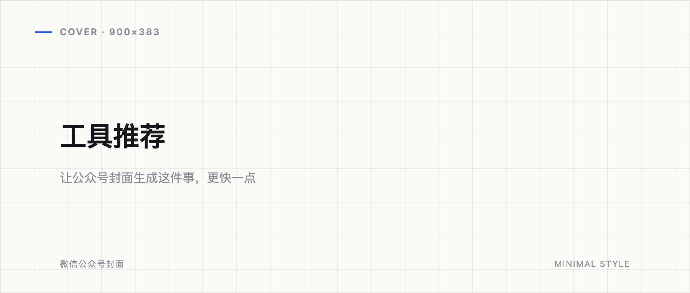
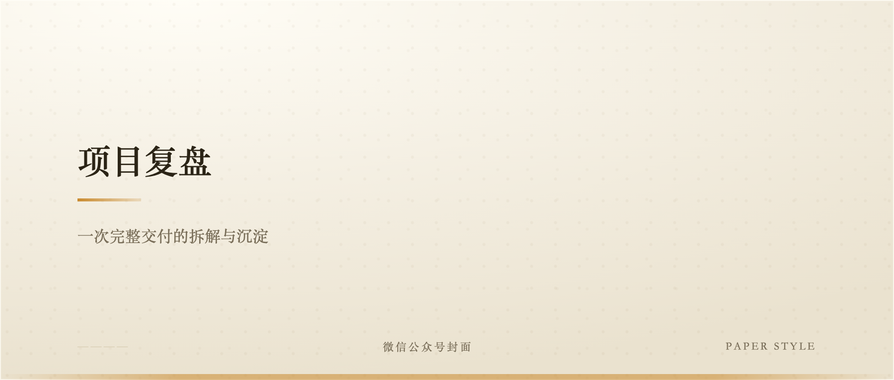
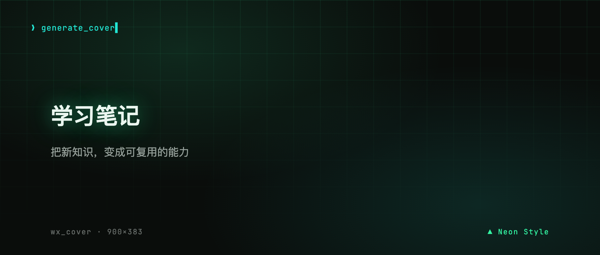
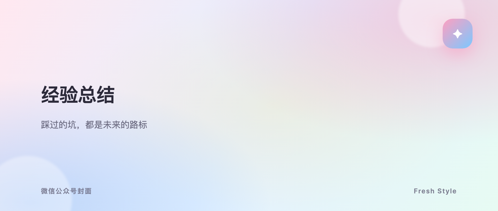

<div align="center">

# 🎨 公众号封面生成工具

**wx_upload_cover_tool** · 用 Playwright 渲染 HTML 模板，一键生成公众号横版封面（900×383）


---

**多套内置样式 · 自适应文字排布 · Web 前端 + 命令行双入口 · 可选微信素材上传**

</div>

## 🤔 为什么用代码生成，而不是让大模型「画」封面？

市面上很多工具用**多模态大模型**一键生成封面，看起来省事，但对公众号封面这种**强模板、强规范**的场景并不合适：

| 痛点 | 多模态生成 | 本工具（HTML 模板渲染） |
|---|---|---|
| 💸 **成本** | 每次生成都要消耗 image token / 多模态 token，量一大成本可观 | **零多模态调用**，只消耗本地 CPU 渲染，无 token 成本 |
| 📐 **跑偏** | 模型自由发挥，尺寸、构图、文字位置常跑偏，出图不可控 | **固定 900×383**，严格按模板渲染，绝不跑偏 |
| 🎨 **风格** | 每次风格漂移，难以保持一致 | **风格完全可控**，同一套 CSS 模板，次次一致 |
| 🏷️ **文字** | 文字内容可能被模型改写、加字、漏字 | **文字精确注入**，标题/副标题 100% 就是你写的 |
| ✍️ **自定义** | 改样式要反复调 prompt，玄学调参 | 直接改 HTML/CSS，所见即所得，可无限扩展模板 |

**一句话总结**：封面是「排版」问题，不是「创作」问题——交给模板引擎精确渲染，而不是让模型自由发挥。**省钱、不跑偏、风格稳、好定制。**

---

## ✨ 封面样式预览

每个样式都是一个独立的 HTML 模板，按同一套渲染契约工作，可一键切换：

<table>
  <tr>
    <td width="50%" align="center"><br><b>极简</b> · 干净留白</td>
    <td width="50%" align="center"><br><b>深空</b> · 深邃星空</td>
  </tr>
  <tr>
    <td width="50%" align="center"><br><b>暖纸</b> · 温暖纸质</td>
    <td width="50%" align="center"><br><b>霓虹</b> · 炫彩霓虹</td>
  </tr>
  <tr>
    <td width="100%" align="center" colspan="2"><br><b>清新</b> · 自然清爽</td>
  </tr>
</table>

> 上图为五套内置样式的实际渲染效果。新增样式只需加一个 HTML 模板文件，在 `wx_upload_cover.py` 的 `TEMPLATES` 字典注册即可。

---

## 🚀 功能特性

- 🎨 **多套内置封面样式**：极简 / 深空 / 暖纸 / 霓虹 / 清新，全部基于 HTML/CSS 模板，可自由扩展
- 📐 **固定 900×383 横版**，符合公众号封面尺寸，导出自动规范化
- 🔤 **自适应文字排布**：标题 / 副标题自动缩放适配，支持「眉题」拆分（`[标签] 标题` 语法）
- 🌐 **Web 前端**：实时流式日志，下拉选择标题与模板，勾选是否上传
- 🖥️ **命令行运行**：本地一键生成
- 🔁 **标题 / 副标题互换**：一键突出副标题
- 🔒 **凭据安全**：微信凭据仅存本地 `config/config.ini`，已被 `.gitignore` 屏蔽

---

## 🛠 环境要求

- Python ≥ 3.11
- 依赖：`playwright`、`requests`、`Pillow`、`colorlog`（见 `pyproject.toml`）
- 首次使用请安装 chromium 浏览器内核：

```bash
uv sync --locked
playwright install chromium
```

> 💡 推荐使用 [uv](https://docs.astral.sh/uv/) 管理虚拟环境。

---

## 🔐 配置

工具上传封面到公众号素材库需要微信开放平台凭据。

> ⚠️ **凭据仅保存在本地 `config/config.ini`**，该文件已被 `.gitignore` 屏蔽，**不会上传到公开仓库**。

```ini
# config/config.ini
[wechat]
APPID = 你的APPID
SECRET = 你的SECRET
```

不配置凭据仍可仅本地生成封面（Web 前端取消勾选「生成后上传」即可）。

---

## ▶️ 两种运行方式

### 1) Web 前端（带实时日志）

```bash
uv run python web_server.py
```

浏览器打开：**http://127.0.0.1:8765**

- **TITLE_TEXT**：下拉选择标题
- **封面模板**：下拉选择（极简 / 深空 / 暖纸 / 霓虹 / 清新）
- **SUBTITLE_TEXT**：输入框填写副标题
- **上传开关**：勾选则生成后上传到公众号素材库，不勾选仅本地生成
- **标题 / 副标题互换**：勾选后互换两者的值（让副标题显示在大标题位置，突出副标题）
- 提交后日志**实时流式**打印（生成 PNG → 转 JPEG → 上传），结束后显示结果

### 2) 命令行本地运行

```bash
uv run python wx_upload_cover.py
```

会在 `output/generated_cover_html/` 生成封面，并按配置决定是否上传。

---

## 🧩 自定义 / 新增封面样式

每个样式是一个独立的 HTML 模板文件（如 `cover_template_minimal.html`），需满足渲染契约：

- `<main class="stage">` 固定 **900×383**；
- 存在 `#title`、`#subtitle` 元素（可选 `#eyebrow`）；
- 提供一个 `window.__coverAfterText__()` 函数，在文字注入后做自适应排版；
- 支持 `body.export` 类，出图时去掉外层留白。

新增后，在 `wx_upload_cover.py` 的 `TEMPLATES` 字典里注册名称与文件名即可自动出现在 Web 下拉中。

---

## 📁 目录结构

```
├── wx_upload_cover.py          # 核心逻辑（生成 / 规范化 / 上传）
├── web_server.py               # Web 后端（流式日志）
├── web.html                    # Web 前端
├── cover_template_*.html       # 封面样式模板（极简/深空/暖纸/霓虹/清新）
├── common/                     # logger / config_loader（自包含）
├── docs/preview/               # 封面样式预览图
├── config/config.ini           # 微信 appid/secret（不入库）
├── output/  logs/              # 运行生成物（不入库）
└── start_web.sh                # 一键启动脚本
```

---

## 📄 说明与免责

- 上传功能调用微信「新增永久素材」接口，请遵守微信公众平台使用规范；
- 上传后的素材在素材库中是永久资源，删除需到公众平台后台操作；
- 工具仅用于个人 / 团队内部自动生成封面，本地运行，不收集任何数据。

---

## 📝 License

[MIT](./LICENSE) © 2026 Contributors